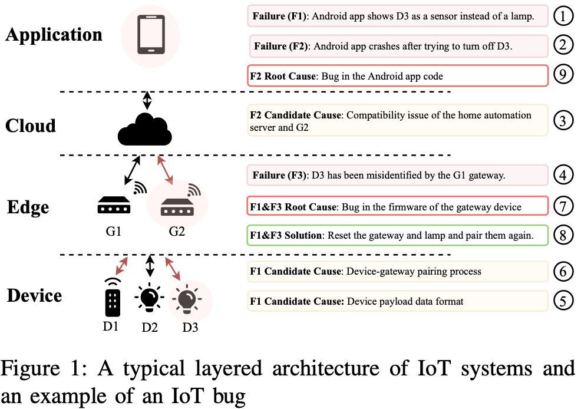
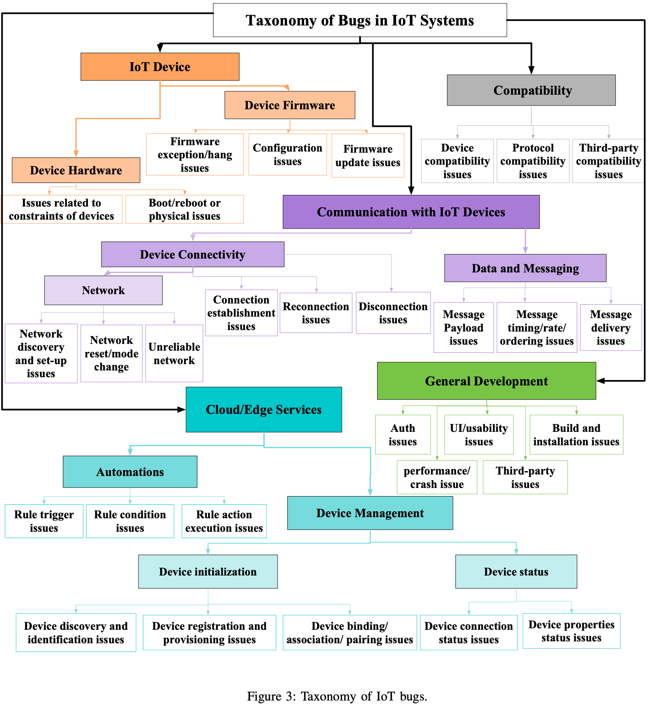
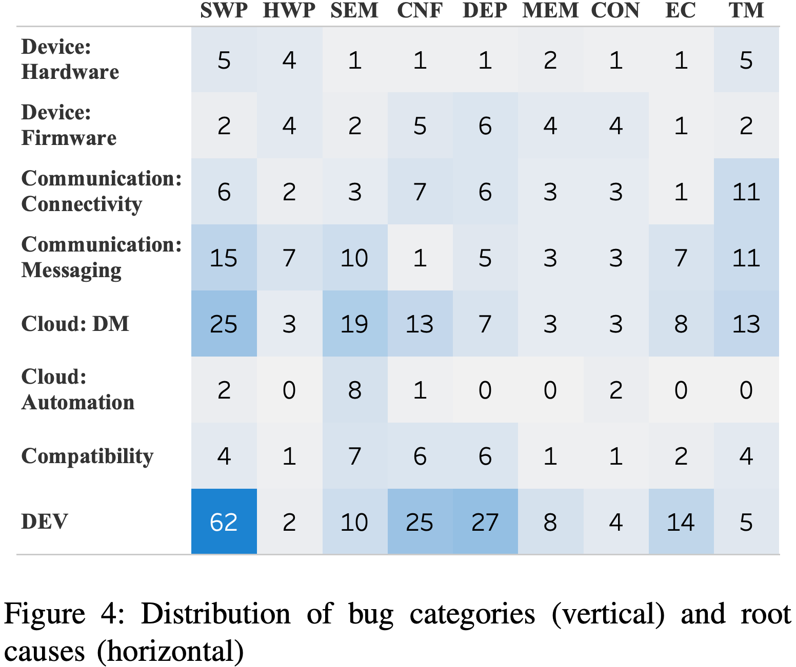
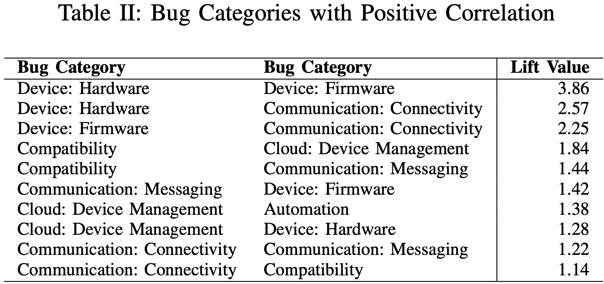
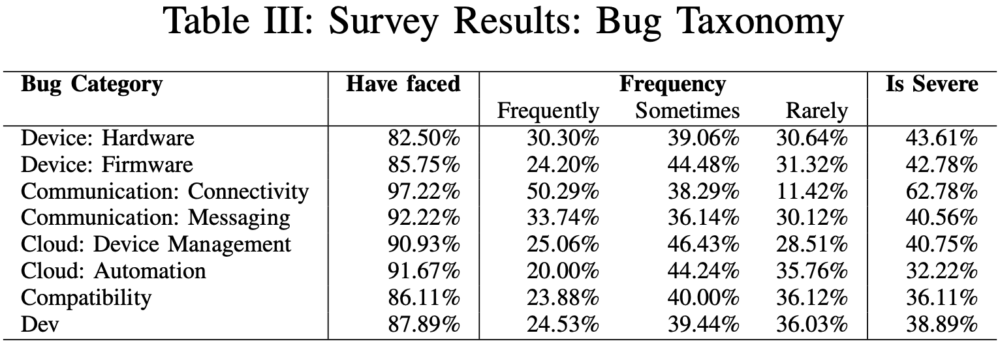
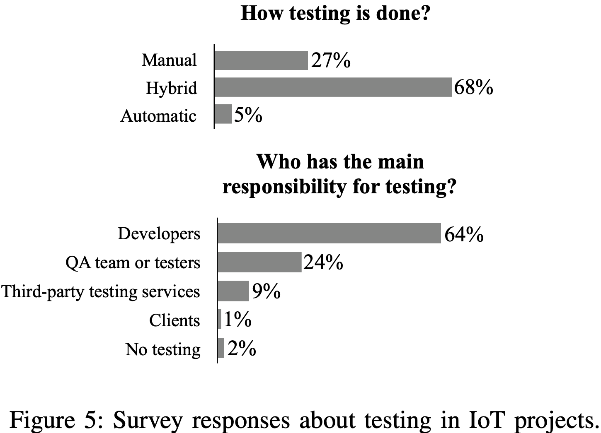

# IoT Bugs and Development Challenges
Author: Amir Makhshari, Ali Mesbah  
Source: [ICSE2021](https://conf.researchr.org/home/icse-2021)  
Paper:  [pdf](https://people.ece.ubc.ca/amesbah/resources/papers/iot-icse21.pdf)  

## Abstract
针对IOT开发人员面临的bugs和挑战，提出了第一篇系统的研究。
提出了第一个针对IOT系统的bug分类系统。

## Method(s)

### Background
作者讲物联网系统分为四层，从下到上包括Device、Edge、Cloud、Application。如图所示：

Device层包括物联网设备，如传感器、执行器等；
Edge层包括网关设备。负责收集、处理物联网设备收集到的数据。负责物联网设备之间、物联网设备同Cloud层之间的通信。
Cloud层处理所有Device收集到的数据，监控、控制所有Device设备。

### Motivating example
图1右侧的步骤显示了开发人员查找漏洞[PYTRADFRI/135](https://github.com/home-assistant-libs/pytradfri/issues/135)的步骤。  
该漏洞由用户发现手机app将电灯（D3）识别为传感器（F1），当APP打开电灯（D3）时发生crash（F2）（步骤1-2）。  
起初开发人员怀疑是网关（G2）同Cloud层不兼容所致（步骤3）。  
最终发现是网关设备将电灯（D3）标示为传感器（F3）（步骤4）。  
由于网关通过设备发送的数据格式来判断设备，因此调试了设备同网关配对时数据的不一致性（步骤5）。  
由于设备电量及距离影响网关的配对过程，开发人员在不同环境下进行了调试（步骤6）。  
确定原因为网关（G2）中的外部错误（步骤7）。重启网关及设备后配对成功（步骤8）。但此时错误2（F2）仍旧发生。通过Wireshark调试App接收到的数据包发现，F2是App中的bug（步骤9）。  

### Methodology
目标是在IoT系统中描述软件漏洞，理解开发人员面临的挑战。提出了两个问题：  
RQ1:IoT系统中的Bug有哪几类？  
RQ2:IoT开发人员面临了哪些挑战？  
针对第一个问题，分析了github中91个开源物联网项目的323个issues和pull requests。针对第二个问题，采访了IoT系统开发专家。  

## Evaluation
介绍了调查结果。

### IoT bug分类

IoT Device：可以分为硬件相关和固件相关。硬件相关漏洞同硬件有关，一类如线路问题、pin脚状态问题、传感器、执行器中包含的问题等。PEDALINOMINI/34是因为没有区分物理按键的单击和双击。另一类同设备在内存、电量、算力方面的受限有关，其中一个案例是物联网设备在电量过低时发送了错误的数据包。HOMIE-ESP8266/575与过度计算、处理相关；ZWAVE2MQTT/141内存不足；[没有物理时钟](https://blog.pisignage.com/lack-of-hardware-clock-in-raspberry-pi-scheduling-issues/)。固件相关漏洞分为三类：第一类指意外异常和挂起；第二类指设备的配置问题，可以看作为发送给设备的特殊指令，这类bug通常发生在设备接入网络的早期，设备需要被配置以和其他硬件和网络适配；第三类指固件升级问题，这是最常见的问题。

兼容性：当一个bug只发生在特定类型的设备、通信协议、第三方组件中时，它是兼容性bug。不同协议之间的组合也可能出现兼容性问题，如HTTP和MQTT。  

同IoT设备通信：指IoT设备相互之间通信或同其他实体通信时存在的问题。分为连接性问题和数据信息问题。连接性问题指网络出现问题时无法接入网络；数据信息问题指指令无法从云端或App端发送给设备，或指令时间、序列错误。  

Cloud/Edge服务：这类漏洞包括云端提供的服务和网关提供的服务。可以分为设备管理和自动化两个类别。设备管理是指需要监控设备状态并监听用户指令，第一种问题是设备初始化问题和配对问题，如设备无法被云端或网关唯一识别或获取特定权限，导致设备无法使用远程的服务，案例如设备重复认证；两个网关连接同一个设备时产生的冲突。另一种问题是设备状态监控问题，无法获取设备状态。自动化问题可以分为触发、条件和运行。触发问题指达到特定规则但是没有触发，如SMARTHOME/5578和HOME-ASSISTANT-CONFIG/2；条件是指检查触发的条件，通常发生于获取设备状态来检查是否满足触发条件这一过程，如TESLA-API/43；运行指运行后崩溃。  

一般开发：指在开发中，安装、编译、构建项目过程中遇到的崩溃等问题。还包括认证问题，如AZURE-IOT-SDK-C/657；UI相关问题。

### 漏洞特征
根本原因。图4显示了漏洞分布及根本原因。
  
最常见的漏洞是一般开发问题（48%）、设备管理问题（29%）、消息传递问题（19%）。  
最常见的根本原因是软件编程错误（software programming faults, SWP），如语法、语义问题（syntax issues, semantic programming faults, SEM）,语义错误包括错的控制流、功能逻辑或返回值。第二常见的根本原因是依赖错误（dependency faults, DEP），指使用了错误版本的软件库、工具、设备或协议。 导致硬件、连接、信息问题的主要原因是时间错误（timing faults, TM），如没有正确处理操作速度、连接超时、并发导致的超时等。另一类原因是硬件编程错误（hardware programming faults, HWP），如中断处理。其他原因还包括不正确的错误处理（handling exceptional cases, EC），内存错误（memory faults, MEM），并发错误（concurrency
faults, CON），配置错误（configuration faults, CNF）。  

不同漏洞之间的关系。
  

漏洞频率和严重程度。通过采访进行调查。

设备相关的问题是遇到最频繁的问题，其中连接问题最严重。服务漏洞中自动化问题最少，但是91%的开发人员都遇到过。兼容问题是最少遇到的。  

### 测试和调试挑战
#### 最主要的测试和调试方法需要接触到硬件设备 
某些场景下无法接触到硬件设备，则需要远程调试。一些专家认为仿真环境更有利于测试和调试，但是也有很多人认为当前的仿真环境太过于局限。还有其他的挑战如需要花费大量的精力用来获取IoT设备、构造复杂的测试逻辑、构造仿真环境、设置测试环境等。  

#### 错误定位
大部分人认为错误定位是一个很大的障碍，因为没有足够多的系统日志，无法有效获取设备运行状态，导致隐藏较深的错误无法被发现。（DEVICE-OS/1926, ZWAVE2MQTT/141, VSCP/207）

#### 漏洞复现
漏洞场景无法构建是难以复现的主要原因。

#### 组合爆炸
由于开发的厂商不同，导致使用的标准、设备、中间件、邪恶以等都不同，当不同设备组合在一起时，需要测试的组合数量爆炸，给测试造成很大的挑战。 (PY- TRADFRI/135)

#### 测试和调试边缘用例
需要构造用例来覆盖所有场景，但是许多极端用例难以构建。（DEVICE-OS/1926, TEMPERATURE-MACHINE/13）

#### 发育不全的测试文化
当前测试极度依赖开发人员，如图5所示。且自动化程度较低。

### Heterogeneity
#### 设备和协议碎片
需要针对不同的设备使用不同的协议。不保证一个设备上的代码在其他设备上可以运行。

#### 第三方造成的挑战
第三方停止支持造成设备或服务无法使用。

#### 大量的技术、背景和依赖
开发需要了解大量的技术、背景和依赖知识。

### 其他挑战
#### 安全
超过一半的开发人员不相信第三方库的安全性。安全问题增加了开发的复杂程度。

#### IoT设备升级
固件和硬件升级过程中存在很多挑战。

#### 设备的依赖导致开发困难
如IoT设备资源受限。

#### 处理错误
系统崩溃时避免数据丢失和系统unavailable是一个挑战。

## 讨论
### IoT测试方法没有被实际应用
仅有9%的被采访人员提到有使用自动化测试工具。主要原因是仿真环境不完善。

### 没有设备级的监控工具支持
很难获取到设备运行时日志，这对于测试和调试都很重要。

### 碎片化
由于硬件设备淘汰很快，互不兼容，因此需要针对每一种设备维护一套代码。

## Conclusion
本文提出了IoT系统漏洞分类，提出了IoT开发人员面临的挑战。

## Notes
1、与IoT设备相关的漏洞包括硬件相关漏洞和固件相关漏洞。与硬件相关的漏洞是否可以在模拟器中复现，如何复现？ 如电量不足、网络延迟等  
2、如何在仿真环境中发现整个IoT系统中的缺陷？  
3、如果考虑IoT设备的使用环境的话，IoT系统的逻辑漏洞似乎比代码漏洞更值得检测，因为固件的代码漏洞与普通软件代码漏洞没有什么区别。文章[Reviewing IoT Security via Logic Bugs in IoT Platforms and Systems](https://ieeexplore.ieee.org/stamp/stamp.jsp?tp=&arnumber=9354860)中描述了20个IoT系统中的逻辑漏洞。  