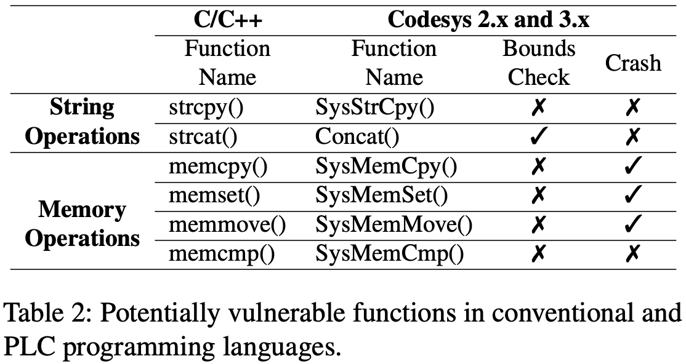
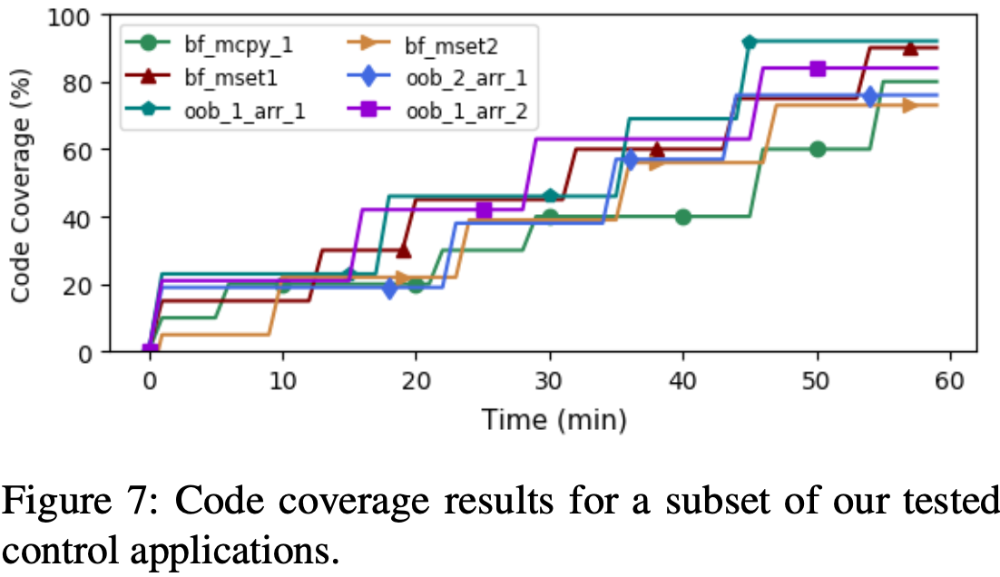

# ICSFuzz: Manipulating I/Os and Repurposing Binary Code to Enable Instrumented Fuzzing in ICS Control Applications
Author: Dimitrios Tychalas, Hadjer Benkraouda, Michail Maniatakos    
Source: [USENIX Security 2021](https://www.usenix.org/conference/usenixsecurity21)  
Paper:  [pdf](https://www.usenix.org/system/files/sec21fall-tychalas.pdf)  

## Abstract
这篇工作调研了利用PLC（Programmable Logic Controllers）二进制文件以及其相关环境的可能性。测试了不同IEC 61131-3控制系统编程语言在编译方面和引入缺陷的不同。基于此分析实现了模糊测试框架来测试PLC二进制可执行文件及其交互功能。通过在线收集和内部开发的固件来测试了系统的正确性。  

## Background
作者在调研中提出了三个问题：  
（1）PLC二进制文件是使用专有编译器从高级PLC编程语言编译的，是否会引入安全漏洞？  
（2）PLC二进制文件由runtime加载并作为PLC操作系统。runtime是从常规 C/C++ 源代码编译的，它们有多脆弱？  
（3）PLC二进制文件的执行受实时约束，并且大量使用GPIO，是否可以利用模糊测试来发现潜在漏洞？  

### 威胁模型
假设场景如下：在工业环境中，PLC控制操作功能、接收来自传感器的输入并确保执行器操作正确，并且PLC是负责调解控制逻辑应用程序的主机。工程师可在人机界面(HMI)上通过网络与其交互。传感器和执行器也在网络中，直接与PLC设备通信。  
在威胁模型中，攻击者可以向目标 PLC 提供某种形式的输入数据。 输入数据传递的示例如下：  
（1）从HMI到PLC的中间人攻击。HMI端的Codesys框架可以实时强制更改PLC二进制文件中的任意值；  
（2）传感器提供输入的中间人攻击；  
（3）固件木马修改固件中的值；  
（4）恶意的内部人员通过HMI修改二进制可执行文件中的值。  

### Codesys Runtime
Codesys国际工业标准 IEC 61131-3下的多平台开发环境，用于对控制应用程序进行编程。Codesys runtime框架是与控制程序、系统功能、用户交互有关的后端处理程序。架构如图1所示。
  
runtime本身是一个自包含的ELF，存放在/usr/bin目录下，系统初始化时通过一个封装好的进程调用，这一过程包含在etc/init.d初始化脚本中。runtime在初始化阶段会加载一个通信相关的函数数组，如网络、外设、进程间通信等。所有的函数会被通过系统调用clone实例化为进程下的一个线程。KBUS是一个进程间通信系统，用于在runtime线程间转发消息、将消息从GPIO端口转发给控制程序。一个调度系统也会被初始化，用于分配优先级、控制锁、处理异常和watchdog。表1列举了runtime中的子线程。  

控制应用程序加载过程在runtime初始化期间开始，对应用程序二进制文件所在的文件夹位置进行文件打开系统调用，该位置硬编码在二进制文件中。然后runtime开始在内存中复制控制应用程序代码和数据。在完整加载应用程序文件到内存之后，启动执行，由基于pthread API的一组自定义函数处理。控制程序二进制代码被推送到新实例化线程的栈中，强制在所有主进程线程的栈段上启用执行权限。除了控制应用程序加载/执行之外，runtime还会产生两个与应用程序本身相关的实用程序线程，即KBUS_CYCLE充当应用程序和KBUS之间的中介，而VISU基于嵌入到其源代码中的信息提供控制过程的可视化。  

### 控制程序二进制文件
控制程序二进制文件同传统的二进制文件（ELF、PE）有很大的不同。相同点在于都是由一个头段、主程序段、数据段、静动态连接库组成。主要的区别在于控制程序二进制文件无法独立运行。控制程序二进制文件以头段开始，头段包含重要的信息，包括程序的入口地址、栈的大小、动态链接库的标识符等。头段后面是一个子线程，用于设置常量和IDE全局变量中使用的初始化函数。  
控制程序二进制文件也包含调用从库和用户定义的Functions or Function Blocks（F/FB）中调用。这两者都是静态链接的，并以两个连续子线程的格式包含在二进制文件中。第一个包含表示 F/FB 功能的指令，第二个初始化其本地存储器。接下来将PLC的主要功能（PLC_PRG）封装在下一个子线程中。这个子线程包含控制逻辑。控制二进制文件中的动态链接函数通过位于最后一个代码子线程之后的符号表进行解析。符号表包含两个字节的数据，运行时使用这些数据来计算调用相应函数所需的跳转偏移量。  

## Method(s)
### 控制程序分析
通过分析来确定PLC编程语言在内存操作方面是否安全。  
PLC的控制应用程序可以用不同的语言开发，包括图形和文本。为了标准化PLC供应商使用的编程语言，国际电工委员会(IEC)制定了IEC 61131-3 标准。该标准通过定义编程语言、数据类型和变量属性，概述了PLC的软件架构和编程。分析中排除指令表(IL)，因为它是一种非活动语言，而顺序功能图(SFC)语言则由对其他PLC编程语言的调用组成，因此不具有内在特征：  
（1）LadderDiagram(LD):（图形）这种语言类似于电路并取代了硬接线继电器控制系统。由于LD处理基本组件（即触点和线圈），代表大型当代系统并保持视觉全面性变得困难。LD也缺乏对算术运算和数据结构（如数组和指针）的原生支持。  
（2）FunctionBlockDiagram(FBD):（图形）FB也基于链接功能块 (FB)的接线图。FB是PLC编程语言使用的编程结构，其使用方式与传统编程语言中使用的功能相同。  
（3）StructuredText(ST)：（基于文本）这种语言最接近高级计算机编程语言，基于Pascal。它使用条件语句、循环和类似的数据结构，例如指针和数组。  
三种语言如图2所示。  

作者通过比较不同语言生成的二进制可执行文件之间的不同来发现不同编程语言之间的不同，如使用vbindiff。通过分析发现，编译器在二进制文件中插入了大量的No-operation instructions (NOPs)。是为了内存对其，NOPs的数量同二进制文件大小正相关。  
作者分析了典型内存缺陷的崩溃情况，如表2所示。

### Fuzzing ICS
作者通过替换二进制文件中的NOPs来打印当前执行的指令，以此计算代码覆盖率。ICS固件运行在实际硬件中，电脑通过ssh同硬件进行连接。模糊测试部分使用AFL。通过crash来判断是否触发缺陷。  

#### 模糊测试控制应用
Fuzzing可以被分为两个部分：执行控制和输入生成。第一部分处理执行，与系统通信以启动执行并接收常规/意外的执行终止信号。第二部分调节输入数据，这些数据将被提供给二进制文件并导致执行流程偏差，这可能导致意外/不可恢复的状态。  
执行控制分为两种：同步和异步。同步控制程序遵循扫描周期模型，定期检查预定的内存映射地址以进行输入更新，根据接收到的值执行操作并写入相关的输出地址。异步控制可以接收外部信号以进行输入更新或终止，并且只能执行一次。  
同步（固定周期）程序限制了模糊测试的最大潜力，因为受控执行是提高效率的主要因素。对于这些程序，严格控制输入时间，利用指定时间范围内的每个可用执行周期提供输入。异步程序通过操纵启动和/或终止其操作的输入信号来提供直接执行控制。通过操纵这个信号，可以启动一个执行实例并监视相应的终止信号，以便可以启动下一个执行，这允许进行更传统的模糊测试过程。然而，异步程序是PLC程序的特例，构成了可用二进制文件的一小部分，限制了这种方法的适用性。  
输入控制：输入控制是模糊测试过程中最关键的部分。输入通常是物理信号，模拟或数字，由专用外设（I/O 模块）接收。该设备连接到处理器，并将物理信号转换为可用信息，通过标记为“GPIO”的Linux设备传递给 PLC，该设备通过KBUS子线程与运行时进程通信。KBUS然后在每个扫描周期将输入数据转发到控制应用程序。输入交付遵循以下流程：  
1. I/O 模块接收来自传感器的信号，并通过 GPIO 将其中继到 PLC。  
2. GPIO 接收输入数据并将其存储在其内存映射空间中。  
3. KBUS 打开 GPIO 设备文件并在运行时进程中执行读取系统调用，将输入数据移动到其自己的内存空间。  
4. KBUS_CYCLE_TASK，与控制进程一起产生的线程，通过写系统调用将输入数据传送到控制进程内存空间。 此事件可根据控制应用程序的扫描周期长度重复一段时间。  

如图3所示：

作者通过监视KBUS来确定输入周期，并通过向KBUS内存地址拷入数据来实现输入。

#### 模糊测试runtime框架
runtime作为OS中一个可执行的ELF，拥有1000多个功能和将近5000多个函数，通过静态分析发现其中的缺陷几乎不可能。

## Evaluation
实验对象是WAGO PFC-100 PLC，它使用TI AM335x chipset，
Cortex-A8 ARM processor at 600MHz and 256Mb RAM。通过ssh连接。
### 工具效率

### 工具发现缺陷的能力

作者使用栈溢出、数组越界和除零作为检测目标。其中除零并不会触发crash，因为固件并没有真正调用硬件进行触发操作，而是使用了库函数，当除数为0时，结果为0.

### 代码覆盖率

## Conclusion

## Notes
1. 改工作为基于真实环境的模糊测试工作，利用ICS中系统和上层控制模块之间的runtime框架实现了模糊测试中的输入、控制、代码覆盖率计算。普通物联网固件中并不存在runtime框架，在基于真是环境的模糊测试中如何传递输入、如何控制固件是应当思考的问题。
2. 通过实验工具效率可以发现，基于真实环境的模糊测试速度远大于基于模拟环境的模糊测试。
3. 通过实验代码覆盖率可以发现，覆盖率高达90%，这个是基于模拟环境的模糊测试达不到的。但是作者并没有仔细讲模糊测试中的反馈机制和变异机制。作者使用的初始化种子为0，或者针对特定网络输入为人工编写的初始种子。